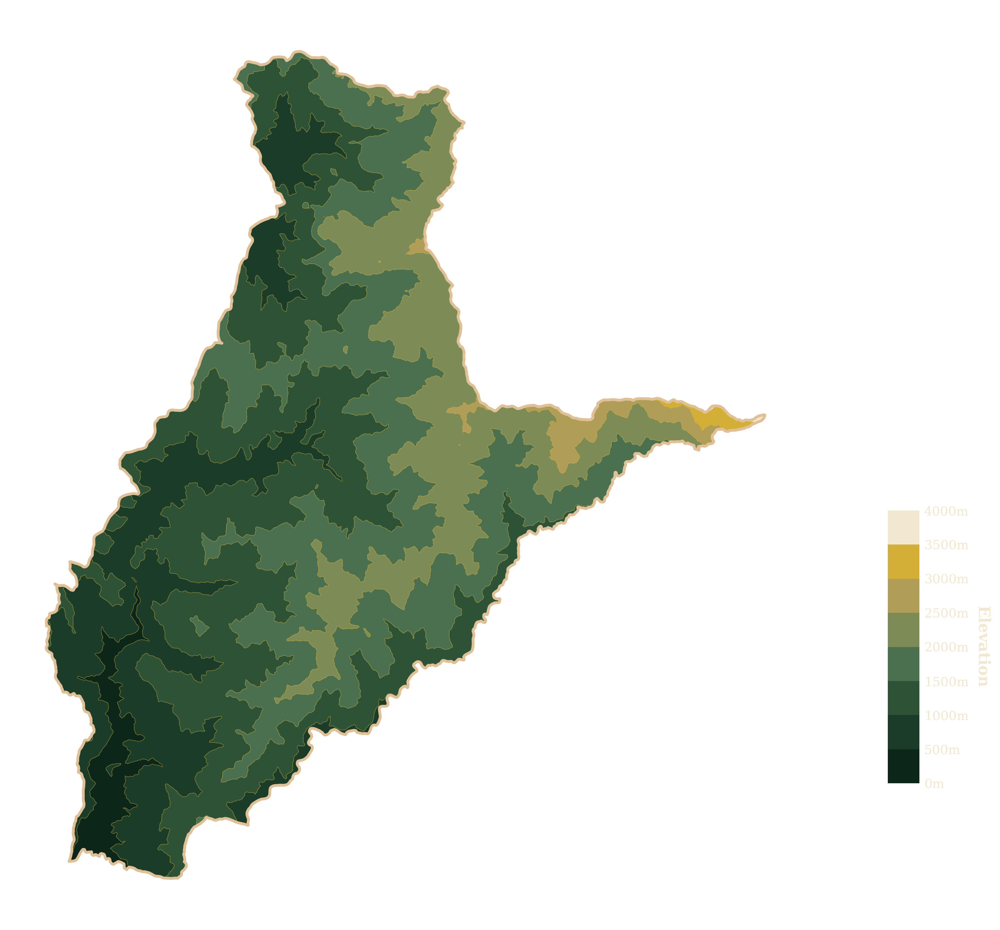

# 🌄 臺灣阿里山精品咖啡 | Taiwan Alishan Coffee

<p align="center">
  
</p>

<p align="center">
  <strong>探索得獎莊園，品味高海拔風土</strong>
</p>

<p align="center">
  
  
  
</p>

---

## 📖 專案簡介

這是一個展示**台灣阿里山鄒族精品咖啡**的互動式網站，精心呈現三大咖啡產區的莊園資訊、得獎紀錄與精品咖啡產品。網站採用**深色奢華設計風格**，配合**金色系主題**，完美詮釋台灣高山咖啡的精品質感。

### 🎯 核心特色

- **📍 互動式地圖**：可點擊的阿里山咖啡產區地圖，直觀展示三大部落位置
- **🏆 得獎莊園展示**：詳細介紹各莊園的獲獎紀錄與特色
- **☕ 精品咖啡產品**：9款精選咖啡的完整資訊，包含風味描述、處理法、價格等
- **🎨 奢華視覺設計**：深色背景配合金色漸變，營造高端品牌質感
- **📱 響應式設計**：完美適配各種裝置尺寸

---

## 🌟 主要功能

### 1. 🗺️ 首頁 - 阿里山風味地圖

- **互動式地圖**：點擊地圖上的標記點，快速跳轉到對應部落介紹
- **三大產區展示**：
  - 🌲 **樂野 Lalauya** - 海拔 1200m | 楓香故鄉・高山咖啡聚落
  - 🏔️ **達邦 Tapangʉ** - 海拔 900m | 鄒族文化重鎮・最大的傳統聚落
  - 🌿 **特富野 Tfuya** - 海拔 1050m | 山林環境中的水洗咖啡產地

### 2. 🏆 莊園介紹

每個產區都詳細展示：
- **代表莊園**：主理人資訊、位置
- **得獎紀錄**：COE、台灣精品咖啡評鑑等獎項
- **Google Maps 嵌入**：實際地理位置標示
- **視覺滾動效果**：優雅的淡入動畫

#### featured 莊園

**樂野部落**
- 鄒築園（方政倫 - 咖啡王子）
- 優遊吧斯瑪翡咖啡莊園
- 鄒讚咖啡

**達邦部落**
- 七彩琉璃咖啡莊園（2025 COE 第一名）

**特富野部落**
- 飛鼠咖啡 Peisu Coffee
- 他扶芽 tfu'ya 有機農園
- 雅慕伊咖啡莊園

### 3. ☕ 產品頁面

- **分類展示**：按產區分類的手風琴式設計
- **詳細資訊**：
  - 🏆 獲獎標籤（特等獎、COE名次等）
  - 💰 價格選項（濾泡式、半磅等）
  - 🌱 產區資訊（海拔、品種、處理法等）
  - 👃 風味描述（乾香、濕香、啜吸）
  - 🎯 咖啡36香標籤
- **外部購買連結**：直接導向官方販售平台
- **商品圖片**：精美的產品視覺呈現

#### 精選產品

1. **鄒築園 藝伎 日曬** - 2024 阿里山咖啡菁英交流賽 特等獎
2. **鄒築園 藝伎 日曬** - 2023 Best of Taiwan COE Pilot 第 9 名
3. **鄒築園 SL34 日曬** - 2025 Best of Cou 鄒族部落咖啡品鑑批次
4. **雅慕伊莊園 藝伎 蜜處理** - 2025 Best of Cou
5. **雅慕伊莊園 藝伎 日曬** - 2024 Taiwan CoE 第五名
6. **豆御香藝妓咖啡莊園 藝伎 水洗** - 2023 COE 第 2 名
7. **飲山郁 日曬**
8. **飲山郁 厭氧日曬** - TCAGs 優選獎
9. **飲山郁 水洗**

---

## 🎨 設計特色

### 配色方案

```css
/* 主色調 - 深色奢華風格 */
背景色：#0F0B09（深棕黑）
金色系：#D4AF37, #FFD700, #BF953F
文字色：#FFECB3, #E6D2B5, #D7CCC8（奶油/米色系）
強調色：#8C6B3F（棕色）
```

### 視覺元素

- **金箔流動漸變**：標題使用動態金色漸變效果
- **毛玻璃效果**：backdrop-filter 模糊背景
- **微互動**：Hover 時的上浮、光暈效果
- **裝飾線條**：金色發光邊條裝飾
- **優雅動畫**：淡入、滑動等流暢過渡

### 字體

- **中文**：思源宋體（Noto Serif TC）
- **英文**：Cinzel, Playfair Display
- **特點**：優雅的襯線字體，營造高級感

---

## 🚀 技術架構

### 後端框架

- **Laravel 12.0** - PHP 現代化框架
- **PHP 8.2+** - 最新 PHP 版本支援
- **SQLite** - 輕量級資料庫

### 前端技術

- **Bootstrap 4.6** - 響應式網格系統
- **Blade Templates** - Laravel 模板引擎
- **Custom CSS** - 客製化樣式設計
- **JavaScript** - 互動效果與動畫

### 設計資源

- **Google Fonts** - 思源宋體、Cinzel 字體
- **Google Maps API** - 地圖嵌入
- **SVG Icons** - 向量圖示

---

## 📦 安裝步驟

### 系統需求

- PHP >= 8.2
- Composer
- Node.js & npm
- SQLite 擴展

### 快速安裝

```bash
# 1. 克隆專案
git clone https://github.com/your-repo/alishan-coffee.git
cd alishan-coffee

# 2. 安裝 PHP 依賴
composer install

# 3. 複製環境變數檔案
cp .env.example .env

# 4. 生成應用程式金鑰
php artisan key:generate

# 5. 建立資料庫（如果不存在）
touch database/database.sqlite

# 6. 執行資料庫遷移
php artisan migrate

# 7. 安裝前端依賴
npm install

# 8. 編譯前端資源
npm run build

# 9. 啟動開發伺服器
php artisan serve
```

### 使用 Composer Scripts（推薦）

```bash
# 一鍵安裝所有依賴
composer run setup

# 啟動開發環境（含 server、queue、logs、vite）
composer run dev
```

### 訪問網站

開啟瀏覽器，前往：
```
http://localhost:8000
```

---

## 📁 專案結構

```
cooffee/
├── app/                      # 應用程式核心
│   ├── Http/Controllers/     # 控制器
│   └── Models/               # 資料模型
├── resources/
│   └── views/
│       └── frontend/         # 前端視圖
│           ├── layouts/      # 佈局模板
│           │   ├── master.blade.php
│           │   ├── header.blade.php
│           │   ├── navbar.blade.php
│           │   └── footer.blade.php
│           ├── index.blade.php      # 首頁（地圖）
│           ├── products.blade.php   # 產品頁面
│           ├── about.blade.php      # 關於頁面
│           └── store.blade.php      # 商店頁面
├── public/
│   ├── img/                  # 圖片資源
│   │   ├── map.png          # 阿里山地圖
│   │   └── *.png            # 產品圖片
│   ├── css/                  # 樣式檔案
│   ├── js/                   # JavaScript
│   └── bootstrap/            # Bootstrap 框架
├── routes/
│   └── web.php              # 路由定義
├── database/
│   └── database.sqlite      # SQLite 資料庫
├── composer.json            # PHP 依賴管理
├── package.json             # Node 依賴管理
└── README.md               # 專案說明文件
```

---

## 🛣️ 路由結構

| 路由 | 頁面 | 說明 |
|------|------|------|
| `/` | 首頁 | 阿里山風味地圖與部落介紹 |
| `/products` | 產品 | 精品咖啡產品展示 |
| `/about` | 關於 | 關於阿里山咖啡 |
| `/store` | 商店 | 購買資訊 |

---

## 🎯 使用指南

### 瀏覽地圖

1. 進入首頁，查看阿里山咖啡產區地圖
2. 點擊地圖上的**金色標記點**（樂野、達邦、特富野）
3. 自動滾動到該部落的詳細介紹

### 探索產品

1. 前往 **Products** 頁面
2. 點擊產區名稱（如：樂野 Lalauya）展開該區域的咖啡產品
3. 查看詳細的風味描述、價格與產區資訊
4. 點擊「**前往購買**」按鈕，連結至官方販售平台

### 了解莊園

1. 在首頁向下滾動
2. 查看各部落的代表莊園介紹
3. 點擊 Google Maps 了解實際位置
4. 瀏覽豐富的獲獎紀錄

---

## 🎨 自訂設計

### 修改配色

編輯各頁面的 `<style>` 區塊：

```css
/* 主要配色變數 */
背景：#0F0B09
金色：#D4AF37
文字：#E6D2B5
```

### 新增產品

編輯 `resources/views/frontend/products.blade.php`：

```html
<!-- 複製現有產品卡片結構 -->
<div class="card coffee-card">
  <!-- 產品內容 -->
</div>
```

### 更新地圖

替換 `public/img/map.png` 並調整 `index.blade.php` 中的標記點座標：

```html
<a href="#leye" class="map-point" style="top: 45.9%; left: 17.4%;">
```

---

## 🌐 外部連結整合

網站已整合以下官方販售平台：

- **歐客佬咖啡** - https://www.oklaocoffee.com/
- **Justin Coffee** - https://www.justincoffee.com.tw/

每款產品都連結到對應的購買頁面，方便使用者直接購買。

---

## 📱 響應式設計

網站完美支援以下裝置：

- 🖥️ 桌面電腦（1920px+）
- 💻 筆記型電腦（1024px - 1920px）
- 📱 平板（768px - 1024px）
- 📲 手機（< 768px）

### 手機版特色

- 地圖自動縮放
- 手風琴式導航
- 觸控友善的按鈕大小
- 垂直堆疊的內容佈局

---

## 🔧 開發指令

```bash
# 啟動開發伺服器
php artisan serve

# 編譯前端資源（開發模式）
npm run dev

# 編譯前端資源（生產模式）
npm run build

# 執行測試
composer run test

# 清除快取
php artisan cache:clear
php artisan config:clear
php artisan view:clear

# 資料庫遷移
php artisan migrate

# 資料庫重置與重新遷移
php artisan migrate:fresh
```

---

## 🤝 貢獻

歡迎貢獻！如果你想改進這個專案：

1. Fork 這個專案
2. 建立你的功能分支 (`git checkout -b feature/AmazingFeature`)
3. 提交你的變更 (`git commit -m 'Add some AmazingFeature'`)
4. 推送到分支 (`git push origin feature/AmazingFeature`)
5. 開啟一個 Pull Request

---

## 📝 授權

本專案使用 MIT 授權條款 - 詳見 [LICENSE](LICENSE) 檔案

---

## 🙏 致謝

- **台灣阿里山咖啡農**：感謝所有辛勤耕耘的咖啡莊園主
- **鄒族部落**：樂野、達邦、特富野的文化與智慧
- **Laravel 社群**：優秀的開發框架
- **Bootstrap**：響應式網格系統
- **Google Fonts**：優質字體資源

---

## 📧 聯絡方式

如有任何問題或建議，歡迎聯繫：

- **Email**: apple0908070605@gmail.com

---

<p align="center">
  Made with ☕ & ❤️ in Taiwan
</p>

<p align="center">
  <strong>探索台灣阿里山的咖啡之美</strong>
</p>
